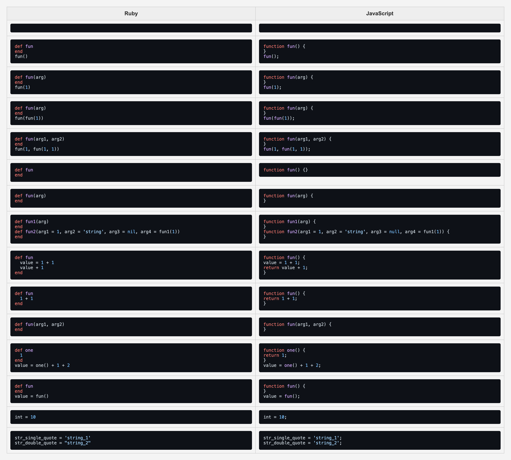

# Ruby Compiler

A Ruby to JavaScript compiler written in Ruby. This project demonstrates core concepts of compiler construction, including parsing, syntax transformation, and code generation. It was inspired by the concepts outlined in this [guide](https://dineshgowda.com/posts/build-your-own-persistent-kv-store/#contents:given-a-cursor-at-the-location-of-the-data-in-file-will-you-be-able-to-read-the-data).

## Example

The image below shows an HTML visual of the **Golden** tests used for this project. It shows example compiler input and output, turning Ruby code into JavaScript code. While the JavaScript shown is unformatted (directly from the compiler), you can **hover to format** the code with `prettier`.



## Goals

#### Philosophical
1. **Testing** as a first-class citizen.

#### Implementation
2. **JavaScript** as the destination language.
3. **Function** declarations and calls.
4. **Variable** declarations and expressions.
5. **Basic operators** (`+`, `-`, `*`, `/`).
6. **Default function arguments** for primitive values.
7. **Implicit return** handling.

## Testing

The core goal with this project was to implement a robust golden file testing similar to Mitchell Hashimoto's implementation in Terraform shown in his [talk](https://www.youtube.com/watch?v=yszygk1cpEc&t=868s) from 2016.

These tests act as a form of black box testing, where we simply test the `Compiler#compile` API with inputs and outputs. It is also important to have tests at the unit level, since the golden tests won't tell you ***where*** something went wrong, only that something ***did*** go wrong.

The golden files can be found in the `testdata` directory, which are used by the `compiler_test.rb` test suite.

### Performance

Part of the golden test's assertions is validating syntax for both the Ruby input and resulting JavaScript. This results in many more system calls (`ruby -c`, `node --check`, file reads/writes, etc.) per test run, creating test suite performance concerns.

One way to solve this is to only validate syntax for code that is being changed. To do this, I created a persistent checksum store of all golden file content, which would be loaded into memory at runtime.

### How it Works
- If the checksum matches the stored value, syntax validation is skipped.
- If the checksum has changed, the test validates the syntax and updates the checksum.

You can check out the implementation in `golden.rb`.

## Usage

### Compile Code

To compile Ruby code into JavaScript, use the `bin/compile` command:

```bash
bin/compile testdata/rb/fun_def.rb test.js
=> Wrote JavaScript to test.js
```

### Start Golden Test UI Server

The golden test results can be visualized using a custom HTML server. Start the server using:

```bash
cd testdata-site && deno run dev
```